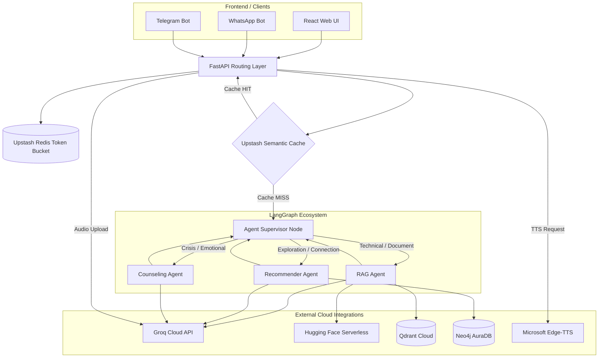

# Sahayak AI - Project Knowledge Base
**Active Pipeline:** `v2_advanced` (`sahayak_ai_v3/`)
**Target Environment:** Render Free Tier (512MB RAM Ceiling, Single Uvicorn Worker)
**Last Updated:** September 2026

---

## 1. System Architecture Diagram & Topology



---

## 2. Complete Directory Layout

```text
sahayak_ai_v3/
├── backend/
│   ├── agents/                   # LangGraph Multi-Agent Ecosystem
│   │   ├── __init__.py           # Unified agent exports
│   │   ├── graph_state.py        # GraphState TypedDict & message reducers
│   │   ├── supervisor.py         # Main LangGraph assembly & routing logic
│   │   ├── rag_agent.py          # Hybrid RAG & Visual Citation extraction
│   │   ├── recommender_agent.py  # Async Neo4j Graph traversal
│   │   └── counseling_agent.py   # Groq triage, crisis helplines, fail-open logic
│   ├── api/                      # FastAPI Route Definitions
│   │   ├── chat.py               # REST Chat orchestrator
│   │   ├── voice.py              # STT (Groq Whisper) & TTS (Edge-TTS)
│   │   ├── payments.py           # UPI Gateway & Webhook verification
│   │   └── health.py             # Deep ping & Outage monitors
│   ├── cache/                    # Upstash Redis Semantic Caching
│   │   └── semantic_cache.py     # Embedding generation and vector cache matching
│   ├── core/                     # Application Core
│   │   ├── config.py             # BaseSettings environment configuration
│   │   ├── security.py           # Rate limiters & token validation
│   │   └── telemetry.py          # Log masking & Correlation ID generation
│   └── main.py                   # FastAPI Application Entrypoint
├── tests/                        # Pytest Test Suite
│   ├── agents/                   # LangGraph state & fallback tests
│   ├── api/                      # Integration tests for routes & dependencies
│   └── load/                     # Locust & k6 performance benchmarking
└── requirements.txt              # Production dependency lockfile
```

---

## 3. LangGraph State Schema Reference

The multi-agent graph uses a strictly typed dictionary (`GraphState`) ensuring immutability across the node boundaries.

```python
from typing import TypedDict, Annotated, Any, Optional
from langchain_core.messages import BaseMessage
from operator import add

def add_messages(left: list[BaseMessage], right: list[BaseMessage]) -> list[BaseMessage]:
    """Reducer that appends new messages while maintaining history."""
    return left + right

class GraphState(TypedDict):
    # Core Memory
    messages: Annotated[list[BaseMessage], add_messages]
    
    # Routing & Flow Control
    next_agent: Optional[str]
    iteration_count: int
    is_emergency: bool
    
    # Agent Specific Payloads (Preventing string bloat)
    visual_citations: Optional[list[dict[str, Any]]]
    graph_data: Optional[dict[str, Any]]
    
    # Metadata & User Context
    user_id: Optional[str]
    tier: Optional[str]
    error: Optional[str]
```

### Fail-Safe Routing Limits
- **`iteration_count`**: Hard-capped at `3` in the Supervisor node to strictly prevent infinite graph loops and memory exhaustions.
- **`is_emergency`**: Preemptively triggers the `Counseling Agent` and bypasses recursive generative hops if crisis keywords are detected or if the Groq LLM triage returns `distress_score >= 0.8`.

---

## 4. API Route Catalog (/api/v3)

| Endpoint | Method | Role | Description |
| :--- | :--- | :--- | :--- |
| `/api/v3/chat/orchestrate` | `POST` | Core Chat | Accepts JSON payload; intercepts via Semantic Cache or invokes LangGraph Supervisor. Returns Text + Citations. |
| `/api/v3/voice/transcribe` | `POST` | STT | Accepts `.webm/.mp3/.m4a` (10MB Max). Uses Groq Whisper API for transcription. |
| `/api/v3/voice/tts` | `POST` | TTS | Synthesizes streaming MP3 audio via `edge-tts`. Returns `StreamingResponse`. |
| `/api/v3/voice/process-voice-chat` | `POST` | E2E Voice | Transcribes audio, invokes LangGraph, returns text, citations, and metadata. |
| `/api/v3/payments/generate-qr` | `POST` | UPI QR | Generates Dynamic UPI QR code via deep linking format. |
| `/api/v3/payments/verify-utr` | `POST` | Verification | Asynchronous validation of user-submitted UTR against bank APIs. |
| `/api/v3/health/deep-ping` | `GET` | Monitoring | Probes DB/Cache connections with strict 2s timeouts. HTTP 503 on failure. |

---

## 5. Environment Variable Dictionary

| Variable | Required | Description | Default / Fallback |
| :--- | :--- | :--- | :--- |
| `SAHAYAK_PIPELINE_VERSION` | Yes | Toggles `legacy` vs `v2_advanced` pipeline routing. | `legacy` |
| `GROQ_API_KEY` | Yes | For `ChatGroq` reasoning and Whisper STT. | `""` |
| `HF_TOKEN` / `HUGGINGFACE_API_KEY` | No* | Token for Serverless embeddings and reranker. | `""` (Falls back to BM25/Sparse) |
| `QDRANT_URL` | No* | Qdrant Cloud Cluster URL. | `""` (Bypasses Retrieval) |
| `QDRANT_API_KEY` | No* | Qdrant authentication key. | `""` |
| `NEO4J_URI` | No* | Neo4j AuraDB connection string. | `""` (Recommender disables DB) |
| `NEO4J_USERNAME` | No* | Neo4j user. | `neo4j` |
| `NEO4J_PASSWORD` | No* | Neo4j password. | `""` |
| `UPSTASH_REDIS_REST_URL` | Yes | Token bucket & Semantic cache REST endpoint. | `""` |
| `UPSTASH_REDIS_REST_TOKEN`| Yes | Token bucket & Semantic cache Auth. | `""` |
| `UPI_MERCHANT_VPA` | Yes | Receiver VPA for Payment QR generation. | `""` |

*(Note: While marked "No*", system degrades gracefully to fallback responses without these)*

---

## 6. Production Runbook & Troubleshooting

### Strict 512MB RAM Compliance (Render Free Tier)
- **Constraint:** The application runs exclusively using lightweight Async clients (`httpx`, `AsyncGroq`, `AsyncQdrantClient`, `neo4j.AsyncGraphDatabase`).
- **Forbidden:** Never install or import `torch`, `transformers`, `sentence-transformers`, `whisper`. Doing so will immediately cause OOM kills on startup.
- **Worker Configuration:** Must be deployed with `uvicorn main:app --workers 1 --host 0.0.0.0 --port 8000`.

### Zero-Downtime Alerts & Log Correlation
- **External Monitor (Total Outage):** GitHub Actions hits `/api/v3/health/deep-ping`. If the server is spun down (cold start) or encounters a 502, it alerts Telegram directly.
- **Log Correlation:** Every request receives a unique `X-Correlation-ID`. Use this UUID to trace requests from Edge -> FastApi -> LangGraph -> Sub-Agents in the Render Dashboard Logs.

### Disaster Recovery
- **Qdrant / Vector DB Outage:** RAG Agent gracefully defaults to sparse search or parametric LLM memory.
- **Neo4j Graph Outage:** Recommender Agent safely returns text stating the service is temporarily unavailable without crashing the application.
- **Groq API Outage:** Triggers an immediate HTTP 502 from the API layer. The pipeline should fall back to Semantic Cache hits, but new generations will fail. Ensure token buckets are strictly enforced to prevent API bill shocking.
